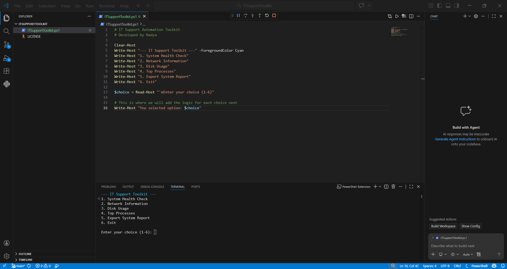
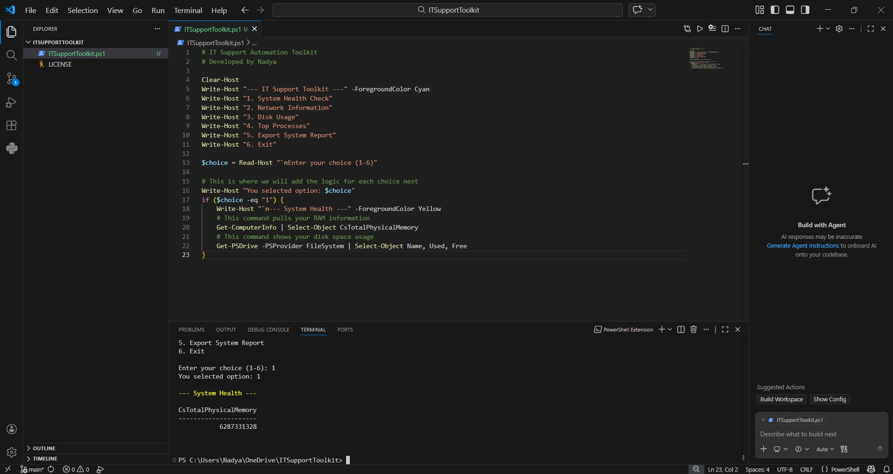
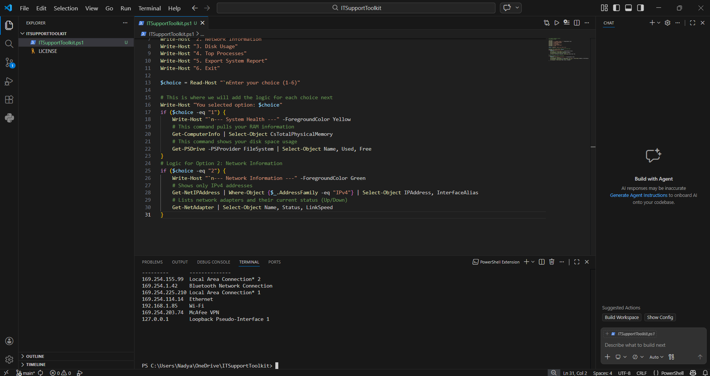
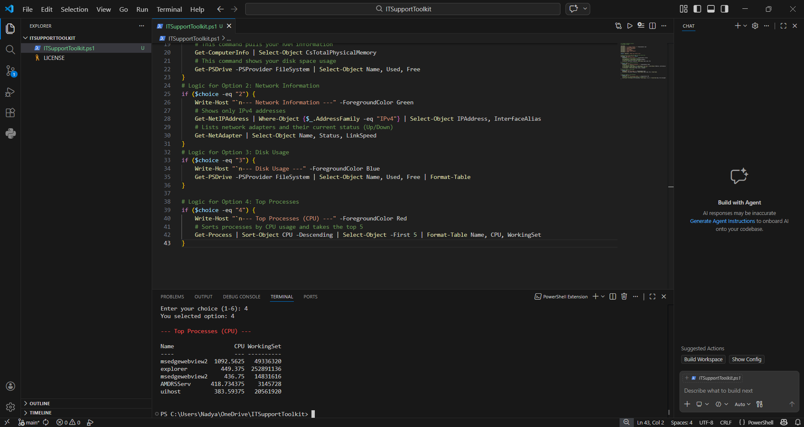
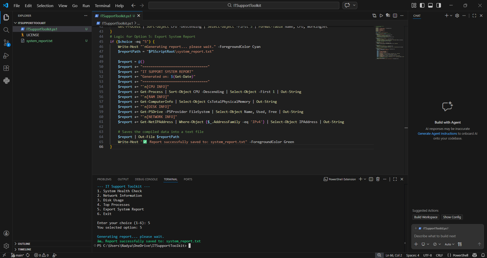

# 🛠️ IT Support Automation Toolkit

## About This Project
I built this toolkit to see how much of a typical IT support "health check" I could automate using PowerShell. Instead of manually digging through different Windows settings to find an IP address or check how much RAM is left, I wanted to create a single command-line tool that handles all those diagnostics at once.

It’s designed to be a "one-stop shop" for a technician to get a quick, accurate snapshot of a computer’s health without wasting time.

## Key Features
- **Interactive Menu:** I built a simple 1-6 interface so you don't have to be a PowerShell expert to get the info you need.
- **Live Hardware Audits:** The script pulls real-time data on memory (RAM) and disk partitions directly from the system.
- **Network Troubleshooting:** It filters out the noise to show only active IPv4 addresses and the status of your network adapters.
- **Performance Filtering:** One of the coolest parts is the process tracker—it automatically sorts and shows the top 5 apps currently hogging the CPU.
- **Auto-Generated Reports:** It compiles all these findings into a text file called `system_report.txt` so you have a digital paper trail of the system's status.

## Tech Stack
- **Language:** PowerShell.
- **Environment:** VS Code (for writing and debugging the logic).
- **System Management:** Windows Management Instrumentation (WMI) via PowerShell commands.

## How to Run It
1. **Permission:** Open PowerShell as Administrator and run `Set-ExecutionPolicy RemoteSigned` to allow local scripts to run.
2. **Launch:** Navigate to the folder and type `.\ITSupportToolkit.ps1`.
3. **Navigate:** Use the menu numbers to run specific checks or export the final report.

## Screenshots

**The Main Dashboard**

**Hardware & Memory Results**

**Network Configuration View**

**CPU-Heavy Process List**

**Final Exported Report**

## Skills & Takeaways
- **Scripting Logic:** I used conditional `if` statements to handle user choices and variables to store system data.
- **Data Presentation:** I learned how to use `Format-Table` and color-coded headers to make technical data actually readable for a human.
- **System Automation:** This project helped me understand how to interact with the Windows backend to pull hardware specs and network details automatically.
- **Cleanup:** Using `Clear-Host` and custom exit messages taught me that a project’s "user experience" is just as important as the code itself.

## License
This project is licensed under the MIT License.